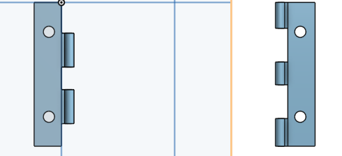

# ultrasonic-robot-assiment-

## google doc ro-bull

### evidince/show of work and proof
docs.google.com/document/d/1AIUPdOaN4_O5V4mFJjYb1tNGThVc8UDLM4Z-CcroI64/edit

## update
found out the boit/screw need to be used in the body of the ro-bull as well as the plan on how to conturct the robot need to be put together now at this stage once done with the exact plan of the robot body. 

## update 
making of hinge is on the way and as well as the screws needed for the bodys walls and the screws and holes for the aurdino.

## update 
shared onshape doc for assiment to dierloff as well as made ajuestment to the body. 

## hinge 

hinge is on the way of being done soon and needs little inprovements 

## hinge update 
need some help on some part of the hinge can be fixed with minor fixes and will be done soon the body and side have been built all that is needed now is just to put it together and see if both part are conguent and have the right measurement set on both as well as the buttons to be put in the hinge. 

## update to notebook 
1.accopclished to fix minor issues with the robot body as well as the T lock being fixed to fit 40 40 boits 
2.time as well as focus on the project and drive 

## note to ne 
i want to work on the T lock and the dimenctions of what i need to put the 40 bolts in 
when i come back from break the thing i want to work on is the T lock and setting up the aurdnio ad putting it on the body and have the right dimetions 

## update on the new redo of robull 
the robull had had a overhall two times of the shape and plan taking out the hinge and making the robull a larger size for part to fit in and more set up but as well as the making of the part being implemented onto the robull body.

### image of new body of robull 

## mistakes and errors 
i have made errors on the underestamating the size of the parts and the body its self which has cause me and my teamate to falter in our plans and redo the body aspect twice as well as the lack of time we had either spent on the project and as well as the lack of us getting out plans moving along at points slowing down at some points of doing work but we had also now when pressure was on us we had overcome some of these problems but some still linger like the slowing down of process and the making of the box and printing the body out. 
                
